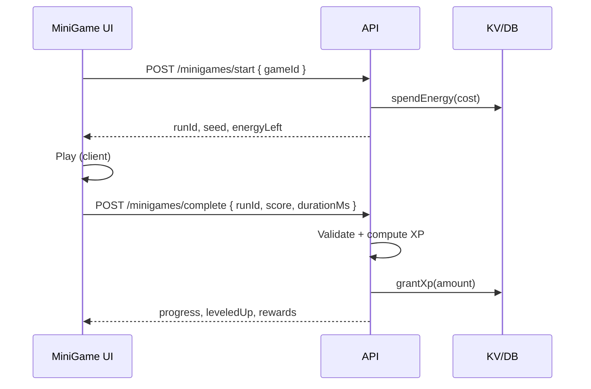

# Plan — XP, niveaux et Énergie (mini-jeux)

Document de référence pour le système de progression du simulateur Spekter Agency.  
**État actuel (v0)** : barre XP visible, niveau calculé côté client + API lecture/écriture basique sur compte connecté ; mini-jeux pas encore branchés.

---

## 1. Objectifs produit

| Ressource | Rôle |
|-----------|------|
| **XP** | Progression permanente du compte (niveau affiché, barre dans le header + onglet Mini Games). |
| **Énergie** | Monnaie de session pour **lancer** des mini-jeux (coût par partie). Se régénère avec le temps. |
| **Niveau** | Dérivé de l’XP totale (`totalXp`), pas stocké séparément (évite les désync). |

Les mini-jeux **ne consomment pas d’XP** : ils en **donnent** (et consomment de l’énergie).

---

## 2. Formules (déjà implémentées)

Fichier partagé : `lib/player-progress.cjs`

- XP pour passer du niveau `L` au `L+1` :  
  `xpNeeded(L) = floor(100 × L^1.2)`
- `totalXp` = somme de toute l’XP gagnée depuis la création du compte.
- Niveau courant = décomposition de `totalXp` en soustractions successives.
- Plafond technique : niveau **999**, grant max **5000 XP** par requête API.

**Énergie (v0)** :

- Cap par défaut : **100**.
- Nouveau compte : énergie pleine au premier login.
- Coût par mini-jeu : à définir par jeu (ex. 5–15 énergie).

**Régénération (v1 — à coder)** :

- Exemple : `+1` énergie toutes les **6 minutes**, jusqu’au `energyCap`.
- Option niveau : `energyCap = 100 + 5 × (level - 1)` (cap 200).

---

## 3. Persistance

| Contexte | Stockage |
|----------|----------|
| Invité | `localStorage` clé `builderPlayerProgress:v1` |
| Connecté | `users[id].progress` dans KV / `data/db.json` |

Champs stockés :

```json
{
  "totalXp": 0,
  "energy": 100,
  "energyCap": 100,
  "energyUpdatedAt": 1735689600000
}
```

À la connexion : **le serveur fait foi** ; migration invité → compte = endpoint dédié (voir §5).

---

## 4. API (existant + à venir)

### Déjà en place

| Méthode | Route | Description |
|---------|-------|-------------|
| `GET` | `/api/profile/progress` | Progression du compte connecté. |
| `POST` | `/api/profile/progress/xp` | Ajout d’XP (réservé mini-jeux / admin ; limité + journalisable). |

### Phase mini-jeux

| Méthode | Route | Description |
|---------|-------|-------------|
| `POST` | `/api/minigames/start` | Vérifie énergie, débite, renvoie `runId` + seed. |
| `POST` | `/api/minigames/complete` | Valide score/temps, accorde XP (formule par jeu). |
| `POST` | `/api/profile/progress/migrate` | Fusionne progression invité (body signé ou one-shot après login). |

Sécurité :

- Jamais faire confiance au client pour l’XP finale : le **complete** calcule la récompense serveur.
- Rate limit par `userId` + IP (ex. 30 parties / heure).
- Log `progressEvents[]` (tronqué) : `{ at, gameId, xp, energySpent }`.

---

## 5. Flux mini-jeu (cible)



**Formule XP exemple** (par partie) :

```
baseXp = 10
bonus = floor(score / 100)   // selon le jeu
xp = min(120, baseXp + bonus)
```

Énergie insuffisante → bouton « Jouer » désactivé + texte « Régénération dans Xm ».

---

## 6. UI

| Zone | Contenu |
|------|---------|
| Header (à côté visites) | Niveau, barre XP, compteur énergie `⚡ current/cap` |
| Profil (menu) | Même résumé + hint « Connecte-toi pour sauvegarder » |
| Mini Games | Carte progression + liste jeux (coût énergie, XP estimée) |

Animations v1 : flash barre + toast « Level up! » quand `leveledUp`.

---

## 7. Jeux prévus (backlog)

1. **Quiz Spekter** — QCM builds / persos (faible coût énergie, XP modérée).
2. **Fusion rush** — enchaîner fusions valides sur timer (XP liée au score).
3. **Guess the mythic** — deviner la recette (bonus streak).

Chaque jeu = entrée config :

```js
{
  id: "quiz-spekter",
  energyCost: 8,
  baseXp: 12,
  maxXpPerRun: 80,
  enabled: false
}
```

---

## 8. Ordre d’implémentation recommandé

1. ✅ Barre + niveau + énergie affichés + `GET /api/profile/progress`
2. Régénération énergie côté serveur à chaque `GET progress`
3. `POST /minigames/start` + `complete` pour un premier jeu simple
4. Migration invité → compte après login
5. Anti-abus (limites, logs) + éventuel leaderboard hebdo (XP gagnée)

---

## 9. Hors scope (pour l’instant)

- Récompenses cosmétiques liées au niveau
- Battle pass / saison
- Énergie achetable
- Sync multi-appareils temps réel (polling 30–60 s suffit au début)
